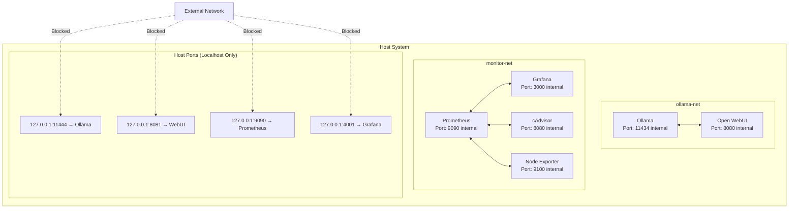

# Security & Network Isolation

This guide explains the security features and network isolation mechanisms that make this LLM stack suitable for sensitive environments, including air-gapped deployments.

## 🔒 Security Overview

### Key Security Features

- **Network Isolation**: Services run in isolated Docker networks
- **Localhost-only Binding**: No external network exposure
- **Air-gapped Compatible**: No mandatory internet dependencies
- **Container Isolation**: Process and filesystem isolation via Docker
- **Persistent Data Encryption**: Optional volume encryption support

## 🌐 Network Architecture

### Isolated Networks

The stack uses two separate Docker networks to prevent unauthorized access:

```bash
# LLM Network (ollama-net)
docker network create ollama-net

# Monitoring Network (monitor-net)  
docker network create monitor-net
```

### Network Topology



## 🛡️ Security Mechanisms

### 1. Localhost-only Port Binding

All services are bound only to `127.0.0.1`, preventing external access:

```bash
# ✅ Secure: Localhost only
-p 127.0.0.1:11444:11434

# ❌ Insecure: All interfaces
-p 11444:11434
```

**Verification:**
```bash
# Check port bindings
netstat -tlnp | grep -E "(11444|8081|9090|4001)"

# Expected output shows 127.0.0.1 only:
# tcp 0 0 127.0.0.1:11444 0.0.0.0:* LISTEN
```

### 2. Container Network Isolation

Services communicate through internal Docker networks, not the host:

```bash
# Internal communication (secure)
OLLAMA_BASE_URL=http://ollama:11434

# External communication (avoided)
# OLLAMA_BASE_URL=http://localhost:11444
```

### 3. Process Isolation

Each service runs in its own container with limited privileges:

```bash
# Run containers with security options
docker run --security-opt no-new-privileges:true \
           --read-only \
           --tmpfs /tmp \
           your-image
```

## 🔐 Access Control

### Default Authentication

**Open WebUI:**
- Requires user account creation on first access
- Supports multiple user accounts
- Chat history isolated per user
- Admin controls for user management

**Grafana:**
- Default: `admin` / `admin`
- Change password on first login
- Role-based access control available
- Dashboard sharing controls

**Prometheus:**
- No authentication by default
- Network isolation provides security
- Can add authentication via reverse proxy

### Enhanced Security Setup

For production or sensitive environments:

```bash
# 1. Create dedicated user for containers
sudo useradd -r -s /bin/false llm-user

# 2. Run containers with specific user
docker run -d \
  --name ollama \
  --user $(id -u llm-user):$(id -g llm-user) \
  --network ollama-net \
  -p 127.0.0.1:11444:11434 \
  ollama/ollama

# 3. Set proper file permissions
sudo chown -R llm-user:llm-user /var/lib/docker/volumes/ollama-data
```

## 🏰 Air-gapped Deployment

### Prerequisites for Offline Installation

1. **Download Docker images** on internet-connected machine:
```bash
# Pull all required images
docker pull ollama/ollama:latest
docker pull ghcr.io/open-webui/open-webui:main
docker pull prom/prometheus:latest
docker pull grafana/grafana:latest
docker pull gcr.io/cadvisor/cadvisor:latest
docker pull prom/node-exporter:latest

# Save images to files
docker save -o ollama.tar ollama/ollama:latest
docker save -o webui.tar ghcr.io/open-webui/open-webui:main
docker save -o prometheus.tar prom/prometheus:latest
docker save -o grafana.tar grafana/grafana:latest
docker save -o cadvisor.tar gcr.io/cadvisor/cadvisor:latest
docker save -o node-exporter.tar prom/node-exporter:latest
```

2. **Transfer to air-gapped system** via secure media

3. **Load images** on air-gapped system:
```bash
# Load all images
docker load -i ollama.tar
docker load -i webui.tar
docker load -i prometheus.tar
docker load -i grafana.tar
docker load -i cadvisor.tar
docker load -i node-exporter.tar
```

### Pre-download Models

Download models on internet-connected system:

```bash
# Run Ollama temporarily
docker run -d --name ollama-temp -v ollama-models:/root/.ollama ollama/ollama

# Download models
docker exec ollama-temp ollama pull llama3
docker exec ollama-temp ollama pull codellama
docker exec ollama-temp ollama pull mistral

# Stop and backup model data
docker stop ollama-temp
docker run --rm -v ollama-models:/data -v $(pwd):/backup alpine tar czf /backup/models.tar.gz -C /data .

# Transfer models.tar.gz to air-gapped system
```

Restore on air-gapped system:
```bash
# Create volume and restore models
docker volume create ollama-data
docker run --rm -v ollama-data:/data -v $(pwd):/backup alpine tar xzf /backup/models.tar.gz -C /data
```

## 🔍 Security Monitoring

### Log Analysis

Monitor security-relevant events:

```bash
# Container security events
docker logs ollama 2>&1 | grep -i "error\|fail\|unauthorized"

# System security logs
sudo tail -f /var/log/syslog | grep -i docker

# Network connection monitoring
sudo netstat -tulnp | grep -E "(11444|8081|9090|4001)"
```

### Prometheus Security Metrics

Add security monitoring queries:

```promql
# Failed authentication attempts (if auth enabled)
increase(http_requests_total{code="401"}[5m])

# Unusual network activity
rate(container_network_transmit_bytes_total[5m]) > 1000000

# Container restarts (potential security issues)
increase(container_start_time_seconds[5m]) > 0
```

### Grafana Security Dashboard

Create alerts for security events:

```json
{
  "alert": {
    "name": "Unauthorized Access Attempt",
    "conditions": [
      {
        "query": {
          "expr": "increase(http_requests_total{code=\"401\"}[5m]) > 5"
        }
      }
    ],
    "executionErrorState": "alerting",
    "noDataState": "no_data",
    "for": "1m"
  }
}
```

## 🚨 Security Best Practices

### Container Security

```bash
# 1. Use specific image tags (not 'latest')
docker run -d ollama/ollama:v0.1.32

# 2. Limit container resources
docker run -d \
  --memory="4g" \
  --cpus="2.0" \
  --pids-limit=100 \
  ollama/ollama

# 3. Run with read-only root filesystem where possible
docker run -d \
  --read-only \
  --tmpfs /tmp \
  --tmpfs /var/run \
  your-image

# 4. Drop unnecessary capabilities
docker run -d \
  --cap-drop=ALL \
  --cap-add=CHOWN \
  --cap-add=SETUID \
  --cap-add=SETGID \
  your-image
```

### Host Security

```bash
# 1. Keep Docker updated
sudo apt update && sudo apt upgrade docker.io

# 2. Configure Docker daemon security
sudo vim /etc/docker/daemon.json
```

```json title="/etc/docker/daemon.json"
{
  "live-restore": true,
  "userland-proxy": false,
  "no-new-privileges": true,
  "log-driver": "json-file",
  "log-opts": {
    "max-size": "10m",
    "max-file": "3"
  }
}
```

### Data Security

```bash
# 1. Encrypt Docker volumes (Linux with LUKS)
sudo cryptsetup luksFormat /dev/sdb1
sudo cryptsetup luksOpen /dev/sdb1 docker-encrypted
sudo mkfs.ext4 /dev/mapper/docker-encrypted
sudo mount /dev/mapper/docker-encrypted /var/lib/docker

# 2. Backup encryption
tar czf - /var/lib/docker/volumes/ollama-data | gpg --symmetric --cipher-algo AES256 > ollama-backup.tar.gz.gpg

# 3. Secure file permissions
sudo chmod 700 /var/lib/docker/volumes/ollama-data
sudo chown root:root /var/lib/docker/volumes/ollama-data
```

## 🔬 Security Verification

### Network Security Audit

```bash
#!/bin/bash
# security-audit.sh

echo "=== Docker Network Security Audit ==="

# Check port bindings
echo "1. Checking port bindings..."
netstat -tlnp | grep -E "(11444|8081|9090|4001)" | while read line; do
    if echo "$line" | grep -q "127.0.0.1"; then
        echo "✅ $line (localhost only)"
    else
        echo "❌ $line (external access possible!)"
    fi
done

# Check network isolation
echo -e "\n2. Checking network isolation..."
docker network ls | grep -E "(ollama-net|monitor-net)"

# Check container security
echo -e "\n3. Checking container security..."
docker ps --format "table {{.Names}}\t{{.Ports}}" | grep -E "(ollama|webui|prometheus|grafana)"

# Check for privileged containers
echo -e "\n4. Checking for privileged containers..."
docker ps --filter "label=privileged=true" --format "{{.Names}}" | while read container; do
    if [ -n "$container" ]; then
        echo "⚠️  Privileged container found: $container"
    fi
done

echo -e "\n=== Audit Complete ==="
```

### Run Security Audit

```bash
chmod +x security-audit.sh
./security-audit.sh
```

## 📋 Security Checklist

### Pre-deployment

- [ ] **Network isolation**: Created separate Docker networks
- [ ] **Port binding**: All services bound to localhost only
- [ ] **Image verification**: Using official images from trusted sources
- [ ] **Resource limits**: Set memory and CPU limits for containers
- [ ] **User permissions**: Running containers with non-root users where possible

### Post-deployment

- [ ] **Access testing**: Verified external access is blocked
- [ ] **Authentication**: Changed default passwords
- [ ] **Monitoring**: Set up security monitoring and alerts
- [ ] **Backups**: Implemented secure backup procedures
- [ ] **Updates**: Planned for regular security updates

### Air-gapped Environments

- [ ] **Image preparation**: Pre-downloaded all required images
- [ ] **Model preparation**: Pre-downloaded required models
- [ ] **Dependency isolation**: Verified no internet dependencies
- [ ] **Transfer security**: Used secure methods for data transfer
- [ ] **Verification**: Confirmed functionality without internet access

---

:::warning Security Notice
While this stack provides strong isolation and security features, always conduct your own security assessment based on your specific requirements and threat model. Consider additional security measures for highly sensitive environments.
:::

Next: [Troubleshooting →](./troubleshooting)